###  - Objectives
Predict the house price given vairous features of dataset.

### - Subgoals
- Exploratory data analysis (EDA)/ Preprocessing
. Histogram  
. Normality/Skewness  
. Missing values  
. Correlations among features  
. Outliers  
- Feature Selection (for predictors)  
. correlation matrix  
. K-best  
. ANOVA test for categorical features  
- Modeling  
. regularized regressoin - LASSO, ElasticNet  
. XGBoost Regression  
- Others  
. categorical predictor by one-hot encoding  


### - References
-  feature selection: http://scikit-learn.org/stable/modules/feature_selection.html
- [exmaple from kaggle-1](https://www.kaggle.com/dansbecker/learning-to-use-xgboost)
- [exmaple from kaggle-2](https://www.kaggle.com/apapiu/regularized-linear-models)
- [exmaple from kaggle-3](https://www.kaggle.com/fiorenza2/journey-to-the-top-10)
- [ANOVA](https://datascienceschool.net/view-notebook/a60e97ad90164e07ad236095ca74e657/) 
      


```python
import pandas as pd
import numpy as np

import matplotlib.pyplot as plt
import seaborn as sns

import scipy.stats as stats
from scipy.stats import norm
%matplotlib inline
```


```python
# import data
df = pd.read_csv('./train.csv')
```

## 1. EDA


** a. Histogram **
check out histogram for some features


```python
#histogram
plt.figure(); sns.distplot(df['OverallQual'],kde=False)
plt.figure(); sns.distplot(df['SalePrice'],kde=False)
plt.figure(); sns.distplot(df['OverallCond'],kde=False)
```


    <matplotlib.axes._subplots.AxesSubplot at 0x11b8114e0>


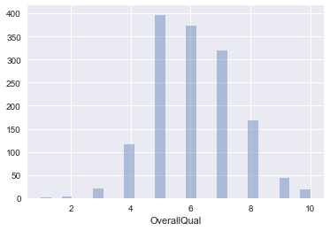


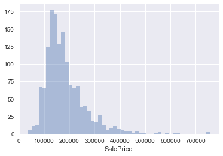


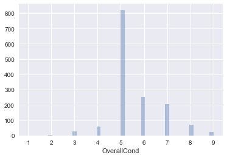


** b. Normality Check **


```python
# - check with skewness and kurtosi
print("\n- Skewness of SalePrice histogram: %f" % df['SalePrice'].skew())
print("\n- Kurtosis of SalePrice histogram: %f" % df['SalePrice'].kurt())
```

    
    - Skewness of SalePrice histogram: 1.882876
    
    - Kurtosis of SalePrice histogram: 6.536282


```python
# - check with Q-Q Plot
plt.figure(figsize=(10,10)); stats.probplot(df['SalePrice'], plot=plt)
```


    ((array([-3.30513952, -3.04793228, -2.90489705, ...,  2.90489705,
              3.04793228,  3.30513952]),
      array([ 34900,  35311,  37900, ..., 625000, 745000, 755000])),
     (74160.164745194154, 180921.19589041095, 0.93196656415129864))


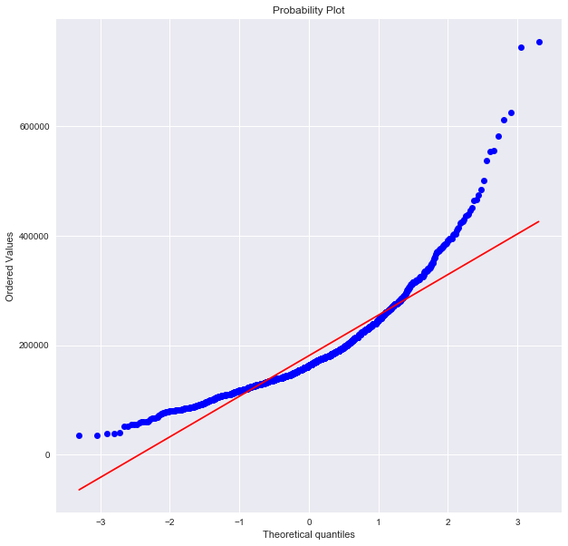


you can simply normalized by taking a logarithm. check out Q-Q plot for normality


```python
# - normalize
plt.figure(figsize=(10,10)); sns.distplot(np.log(df['SalePrice']),kde=True)
plt.figure(figsize=(10,10)); stats.probplot(np.log(df['SalePrice']), plot=plt)
```


    ((array([-3.30513952, -3.04793228, -2.90489705, ...,  2.90489705,
              3.04793228,  3.30513952]),
      array([ 10.46024211,  10.47194981,  10.54270639, ...,  13.34550693,
              13.5211395 ,  13.53447303])),
     (0.39826223081618878, 12.024050901109383, 0.99537614756366133))


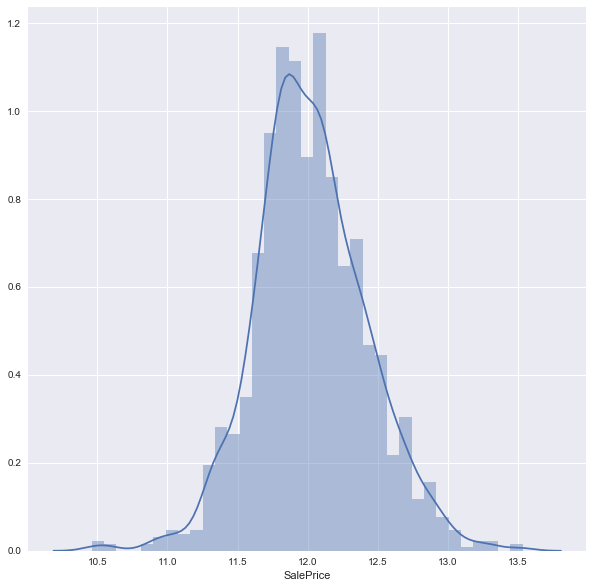


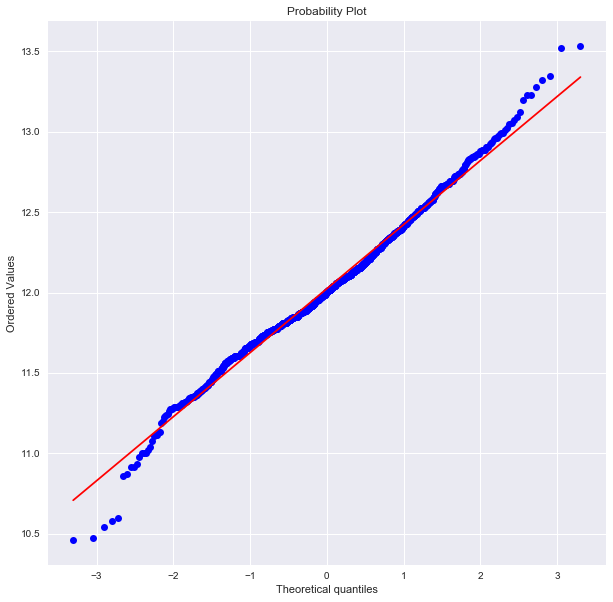


as the 'OverallQual(categorical value)' seems to be the easiest guess for the predictor for 'SalePrice', we can check the relation between them by boxplot. you can see the price gets higer with better overall quality.

** c. Correlations **


```python
plt.figure(figsize=(10,10))
sns.boxplot(df['OverallQual'], df['SalePrice'], color = 'steelblue')
plt.legend(); plt.xlabel('OverallQual'); plt.ylabel('SalePrice')
```

    /Users/Josh/anaconda/envs/venv_py35/lib/python3.5/site-packages/matplotlib/axes/_axes.py:545: UserWarning: No labelled objects found. Use label='...' kwarg on individual plots.
      warnings.warn("No labelled objects found. "


    <matplotlib.text.Text at 0x11c3023c8>


we can check the relations between some features to price as belows. 


```python
plt.figure(); sns.boxplot(df['SaleCondition'], df['SalePrice'])
plt.figure(); sns.boxplot(df['LotShape'], df['SalePrice'])
plt.figure(); sns.boxplot(df['OverallQual'], df['SalePrice'])
```


    <matplotlib.axes._subplots.AxesSubplot at 0x11ceda9b0>


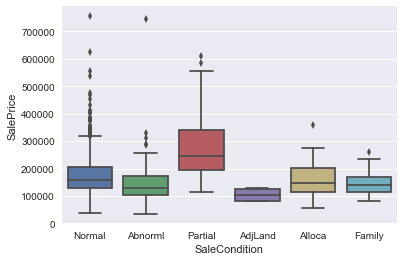


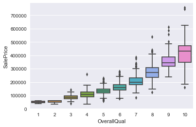


** d. Missing Values **


```python
print("\n - Missinv Value portion: \n", (df.isnull().sum()/len(df)).sort_values(ascending=False))
```

    
     - Missinv Value portion: 
     PoolQC           0.995205
    MiscFeature      0.963014
    Alley            0.937671
    Fence            0.807534
    FireplaceQu      0.472603
    LotFrontage      0.177397
    GarageCond       0.055479
    GarageType       0.055479
    GarageYrBlt      0.055479
    GarageFinish     0.055479
    GarageQual       0.055479
    BsmtExposure     0.026027
    BsmtFinType2     0.026027
    BsmtFinType1     0.025342
    BsmtCond         0.025342
    BsmtQual         0.025342
    MasVnrArea       0.005479
    MasVnrType       0.005479
    Electrical       0.000685
    Utilities        0.000000
    YearRemodAdd     0.000000
    MSSubClass       0.000000
    Foundation       0.000000
    ExterCond        0.000000
    ExterQual        0.000000
    Exterior2nd      0.000000
    Exterior1st      0.000000
    RoofMatl         0.000000
    RoofStyle        0.000000
    YearBuilt        0.000000
                       ...   
    GarageArea       0.000000
    PavedDrive       0.000000
    WoodDeckSF       0.000000
    OpenPorchSF      0.000000
    3SsnPorch        0.000000
    BsmtUnfSF        0.000000
    ScreenPorch      0.000000
    PoolArea         0.000000
    MiscVal          0.000000
    MoSold           0.000000
    YrSold           0.000000
    SaleType         0.000000
    Functional       0.000000
    TotRmsAbvGrd     0.000000
    KitchenQual      0.000000
    KitchenAbvGr     0.000000
    BedroomAbvGr     0.000000
    HalfBath         0.000000
    FullBath         0.000000
    BsmtHalfBath     0.000000
    BsmtFullBath     0.000000
    GrLivArea        0.000000
    LowQualFinSF     0.000000
    2ndFlrSF         0.000000
    1stFlrSF         0.000000
    CentralAir       0.000000
    SaleCondition    0.000000
    Heating          0.000000
    TotalBsmtSF      0.000000
    Id               0.000000
    Length: 81, dtype: float64


Dealing with missing values: take out features with too many missing values, and fill mean values for rest of NaNs.


```python
# Take out columns with too many NaNs
col_nan=(df.isnull().sum()/len(df)).sort_values(ascending=False)[:7].index
df = df.drop(col_nan, axis=1)

# replace with mean of each column for the rest of the features
df = df.fillna(df.mean())

```

## 2.  Feature Selection

** a. Correlation Matrix **  
-  high correlation among predictors --> room for feature reduction 
- high correlation between predictors and dependant variable --> important feature 


```python
""" (1) feature select by correlation matrix """
# - the function automatically only applies for numerical data
corr_matrix = df.corr()
# print (corr_matrix)

# narrow down features to most correlated features with 'SalePrice' 
print ("- Correlation Matrix:\n", corr_matrix['SalePrice'])
print ("\n- Most relavant features by correlation matrix:\n",
       corr_matrix['SalePrice'].nlargest(11).index)
```

    - Correlation Matrix:
     Id              -0.021917
    MSSubClass      -0.084284
    LotArea          0.263843
    OverallQual      0.790982
    OverallCond     -0.077856
    YearBuilt        0.522897
    YearRemodAdd     0.507101
    MasVnrArea       0.475241
    BsmtFinSF1       0.386420
    BsmtFinSF2      -0.011378
    BsmtUnfSF        0.214479
    TotalBsmtSF      0.613581
    1stFlrSF         0.605852
    2ndFlrSF         0.319334
    LowQualFinSF    -0.025606
    GrLivArea        0.708624
    BsmtFullBath     0.227122
    BsmtHalfBath    -0.016844
    FullBath         0.560664
    HalfBath         0.284108
    BedroomAbvGr     0.168213
    KitchenAbvGr    -0.135907
    TotRmsAbvGrd     0.533723
    Fireplaces       0.466929
    GarageYrBlt      0.470177
    GarageCars       0.640409
    GarageArea       0.623431
    WoodDeckSF       0.324413
    OpenPorchSF      0.315856
    EnclosedPorch   -0.128578
    3SsnPorch        0.044584
    ScreenPorch      0.111447
    PoolArea         0.092404
    MiscVal         -0.021190
    MoSold           0.046432
    YrSold          -0.028923
    SalePrice        1.000000
    Name: SalePrice, dtype: float64
    
    - Most relavant features by correlation matrix:
     Index(['SalePrice', 'OverallQual', 'GrLivArea', 'GarageCars', 'GarageArea',
           'TotalBsmtSF', '1stFlrSF', 'FullBath', 'TotRmsAbvGrd', 'YearBuilt',
           'YearRemodAdd'],
          dtype='object')


```python
# narrow down features to most correlated features with 'SalePrice' 
new_corr = df[corr_matrix['SalePrice'].nlargest(11).index].corr()

# check with heatmap w/ new corr matrix
plt.figure(figsize=(10,10))
sns.heatmap(new_corr, vmax=0.8, square=True)
plt.xticks(rotation=45, fontsize= 7);plt.yticks(rotation=45, fontsize= 7);
# plt.legend(); plt.xlabel(''); plt.ylabel('')
# plt.savefig('./figures/heatmap.png'); plt.close(
```


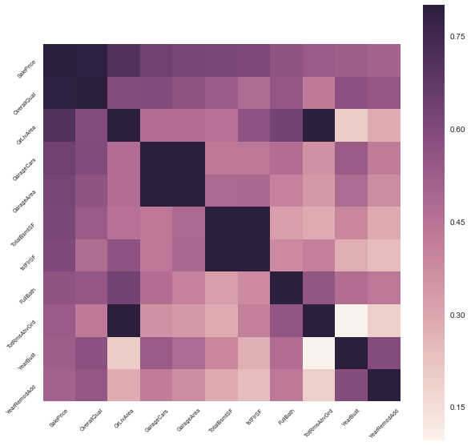


** b. K-Best **  
reference: http://scikit-learn.org/stable/modules/feature_selection.html 


```python
""" (2) feature select by K-Best """
# split categorical data and numerical data
num_df = df.select_dtypes(include=[np.number])
cat_df = df.select_dtypes(exclude=[np.number])
print("\n- among total number of features (%d), "
      "\n-numerical features: %d \n-categorical features: %d"
      % (len(df.columns), len(num_df.columns), len(cat_df.columns)) )

# K-Best
from sklearn.feature_selection import SelectKBest, mutual_info_regression, f_regression
predictors = num_df.columns[:-1] # collect all features w/o target feature
selection = SelectKBest(f_regression, k=5).fit(df[predictors], df['SalePrice'])
# selection = SelectKBest(mutual_info_regression,k=5).fit(df[predictors], df['SalePrice'])

scores = -np.log(selection.pvalues_)# scores = selection.scores_
```

    
    - among total number of features (74), 
    -numerical features: 37 
    -categorical features: 37


```python
plt.figure(figsize=(10,10))
plt.bar(range(len(scores)), scores)
plt.xticks(np.arange(.2, len(scores)+.2), predictors, rotation="vertical")
plt.tight_layout()

# use top 10 most relavant features
scores_sr = pd.Series(scores,index=predictors)
selected_features = scores_sr.nlargest(10)
print ("- Most relavant features by selectKbest(sklearn): \n", selected_features.index)
```

    - Most relavant features by selectKbest(sklearn): 
     Index(['OverallQual', 'GrLivArea', 'GarageCars', 'GarageArea', 'TotalBsmtSF',
           '1stFlrSF', 'FullBath', 'TotRmsAbvGrd', 'YearBuilt', 'YearRemodAdd'],
          dtype='object')


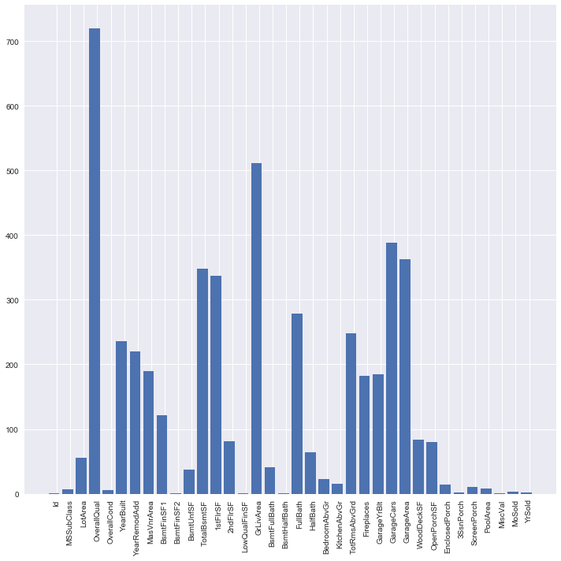


** c. ANOVA test for "CATEGORICAL data" **  
- The one-way ANOVA tests the null hypothesis that two or more groups have the same population mean.
- 해당 feature내의 범주값/그룹 간의 차이가 서로 다른 성격의 그룹이라고 볼 수 있을 정도인지 확인 할 수 있음  
- The ANOVA test has important assumptions that must be satisfied in order for the associated p-value to be valid.  
    . The samples are independent.  
    . Each sample is from a normally distributed population.  
    . The population standard deviations of the groups are all equal. This property is known as homoscedasticity.  
    
// 
- reference (KOR): https://datascienceschool.net/view-notebook/a60e97ad90164e07ad236095ca74e657/
- reference: https://www.kaggle.com/tamatoa/house-prices-predicting-sales-price 


```python
col_cat=list(cat_df.columns)
#print(cat)
def anova_test(inDF):
    anv = pd.DataFrame()
    anv['features'] = col_cat
    pvals=[]
    for c in col_cat:
        samples=[]
        for cls in inDF[c].unique():
            s=inDF[inDF[c]==cls]['SalePrice'].values
            samples.append(s)
        pval=stats.f_oneway(*samples)[1]
        pvals.append(pval)
    anv["pval"]=pvals
    return anv.sort_values("pval")

cat_df['SalePrice']=df.SalePrice.values
k=anova_test(cat_df)
k['disparity']=np.log(1./k['pval'].values)

plt.figure(figsize=(10,10))
sns.barplot(data=k,x="features",y="disparity")
plt.xticks(rotation=90); plt.tight_layout()

```

    /Users/Josh/anaconda/envs/venv_py35/lib/python3.5/site-packages/ipykernel/__main__.py:17: SettingWithCopyWarning: 
    A value is trying to be set on a copy of a slice from a DataFrame.
    Try using .loc[row_indexer,col_indexer] = value instead
    
    See the caveats in the documentation: http://pandas.pydata.org/pandas-docs/stable/indexing.html#indexing-view-versus-copy
    /Users/Josh/anaconda/envs/venv_py35/lib/python3.5/site-packages/scipy/stats/stats.py:2958: RuntimeWarning: invalid value encountered in double_scalars
      ssbn += _square_of_sums(a - offset) / float(len(a))


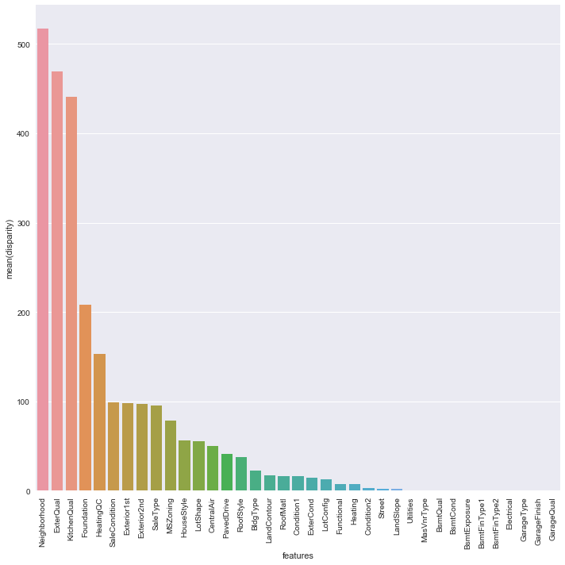


## 3. Modeling & 4. Evaluation / Regularized Regression & XGBoost Regression

** a. Preprocessing**
- normalize skewed data --> *** note that log1p is used otherwise it will result in "infinite" in the table***
- deal with missing values
- deal with outliers


```python
# unskew all data
print(num_df.skew())
skewed_features = num_df.columns[num_df.skew()>0.75]

# *** note that np.log1p() is used, not np.log() ***
# if np.log() is used, the dataframe is filled with -inf
# http://rfriend.tistory.com/295
num_df_norm = np.log1p(num_df[skewed_features]) 
```

    Id                0.000000
    MSSubClass        1.407657
    LotArea          12.207688
    OverallQual       0.216944
    OverallCond       0.693067
    YearBuilt        -0.613461
    YearRemodAdd     -0.503562
    MasVnrArea        2.676412
    BsmtFinSF1        1.685503
    BsmtFinSF2        4.255261
    BsmtUnfSF         0.920268
    TotalBsmtSF       1.524255
    1stFlrSF          1.376757
    2ndFlrSF          0.813030
    LowQualFinSF      9.011341
    GrLivArea         1.366560
    BsmtFullBath      0.596067
    BsmtHalfBath      4.103403
    FullBath          0.036562
    HalfBath          0.675897
    BedroomAbvGr      0.211790
    KitchenAbvGr      4.488397
    TotRmsAbvGrd      0.676341
    Fireplaces        0.649565
    GarageYrBlt      -0.668175
    GarageCars       -0.342549
    GarageArea        0.179981
    WoodDeckSF        1.541376
    OpenPorchSF       2.364342
    EnclosedPorch     3.089872
    3SsnPorch        10.304342
    ScreenPorch       4.122214
    PoolArea         14.828374
    MiscVal          24.476794
    MoSold            0.212053
    YrSold            0.096269
    SalePrice         1.882876
    dtype: float64


Split predictors(X_train) & dependant variable (y; SalePrice)


```python
X_train  = num_df_norm.drop('SalePrice', axis=1)
y = num_df_norm['SalePrice']
```

** a. LASSO regressoin **  

note that R^2 score is used as evaluation matrix. If we splited data for test set, RMSE can be used.


```python
""" (1)-a Regularized Regression : LASSO """
from sklearn.preprocessing import StandardScaler
from sklearn.linear_model import ElasticNetCV, LassoCV
from sklearn.model_selection import cross_val_score

model_lasso = LassoCV(cv=20).fit(X_train, y)
print("LASSO/alpha: ",model_lasso.alpha_)
print("LASSO/Coef: ",model_lasso.coef_)
print("LASSO/R^2 Score: ",model_lasso.score(X_train,y))
```

    LASSO/alpha:  0.000441380629663
    LASSO/Coef:  [ 0.02133863  0.06319689  0.01107165  0.01133217 -0.01055398 -0.00459845
      0.03339088 -0.14267849 -0.04117765 -0.05167887  1.02319654 -0.03696758
     -0.67642781  0.016846    0.02119312 -0.01589131  0.0071636   0.00587626
     -0.01605986 -0.00734329]
    LASSO/R^2 Score:  0.746881679139


** b. ElasticNet ** 


```python
""" (1)-b Regularized Regression : Elastic Net """
model_elastic = ElasticNetCV(cv=20,random_state=0).fit(X_train,y)
print("ElasticNet/alpha: ",model_elastic.alpha_)
print("ElasticNet/Coef: ",model_elastic.coef_)
print("ElasticNet/R^2 Score: ",model_elastic.score(X_train,y))
```

    ElasticNet/alpha:  0.000882761259325
    ElasticNet/Coef:  [ 0.01897788  0.06288092  0.01173252  0.01134066 -0.0105054  -0.00453945
      0.03448621 -0.07296666 -0.03380719 -0.04787024  0.93591079 -0.03637207
     -0.62223445  0.01718832  0.02206114 -0.01598137  0.00742926  0.00610746
     -0.01617787 -0.00747223]
    ElasticNet/R^2 Score:  0.745316818387


** c. XGBoost**  
note that thise time test set (with SalePrice known) is prepared and the RMSE is also used for evaluation matrix.


```python
from sklearn.model_selection import train_test_split

df = pd.read_csv('./train.csv')

# handling with NaNs
df = df.dropna(axis=0, subset=['SalePrice'])
col_nan=(df.isnull().sum()/len(df)).sort_values(ascending=False)[:7].index
df = df.drop(col_nan, axis=1)
df = df.fillna(df.mean())

X = df.select_dtypes(include=[np.number]).drop(['SalePrice'],axis=1).fillna(df.mean())
y = df['SalePrice']
X_train, X_test, y_train, y_test = train_test_split(X.as_matrix(), y.as_matrix(), test_size=0.25)

from xgboost import XGBRegressor
model_XGboost = XGBRegressor().fit(X_train, y_train, verbose=False)

"""Evaluation"""
# a. Mean Squared Error
from sklearn.metrics import mean_squared_error, mean_absolute_error
y_predict = model_XGboost.predict(X_test)

# print ("-MAE: ", mean_absolute_error(y_test, y_predict))
print ("- RMSE: ", np.sqrt(mean_squared_error(y_test,y_predict)) )

# (2) r^2
from sklearn.metrics import r2_score
print("- r^2:", r2_score(y_test,y_predict))
```

    - RMSE:  28337.5912785
    - r^2: 0.890929189221


    /Users/Josh/anaconda/envs/venv_py35/lib/python3.5/site-packages/sklearn/cross_validation.py:41: DeprecationWarning: This module was deprecated in version 0.18 in favor of the model_selection module into which all the refactored classes and functions are moved. Also note that the interface of the new CV iterators are different from that of this module. This module will be removed in 0.20.
      "This module will be removed in 0.20.", DeprecationWarning)


```python
""" tuning more parameters"""
model_XGboost_tuned = XGBRegressor(n_estimators=1000, learning_rate=0.01)\
    .fit(X_train, y_train, early_stopping_rounds=10,
         eval_set=[(X_test,y_test)],verbose=False)

y_predict_tuned = model_XGboost_tuned.predict(X_test)
print ("- RMSE/tuned model: ", np.sqrt(mean_squared_error(y_test,y_predict_tuned)))
print("- r^2/tuned model:", r2_score(y_test,y_predict_tuned))
```

    - RMSE/tuned model:  28711.3952045
    - r^2/tuned model: 0.888032682978


## Further Notes
To improve the model, among lots of methods, you can take following steps: 
- use more features including categorial data by encoding the feature (e.g. one-hot encoding)
[referece(KOR)](https://datascienceschool.net/view-notebook/7dda1bc9ad1c435fb309ea88f672eff9/)
- another exmaple finding a categorical feature to improve the model [example](https://www.kaggle.io/svf/1353045/81ffe596e9a69d92e19c83a2209e270f/__results__.html#4.-Categoric-to-Numeric)

** // End of the document ** 


```python

```
